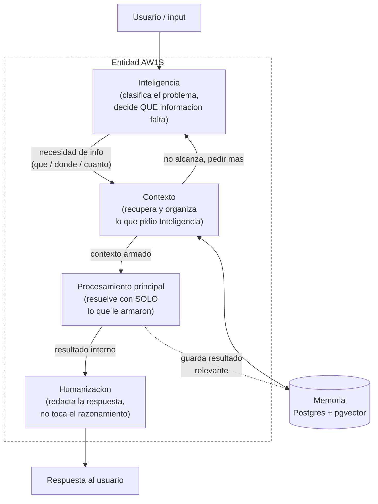
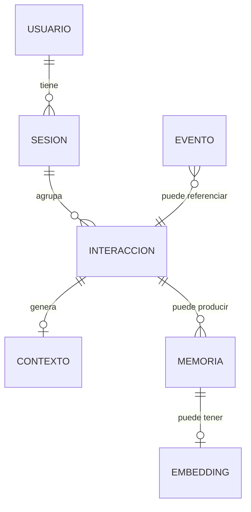

# AW1S — mapa y planos de arquitectura

Carpeta de trabajo para la evolucion "pesada"/MVP de AW1: documentos que se
van pasando, entendiendo, y bajando aca a planos concretos. Todavia no es
codigo ni toca el schema real de AW1 v3 (`backend/src/aw1/db/`) — es la
traduccion de la idea a componentes, para decidir despues que se construye
y como (o si) se conecta con lo que ya existe.

- `planos/` — un archivo por documento/spec que se va recibiendo, en el
  orden en que llega, con el analisis linea a linea. `planos/0.1.0.1-SK.md`
  es el primero (Entidad, capas de pre-procesamiento, memoria hibrida
  Postgres+pgvector).
- `documentacion/` — la version formal/de referencia de cada plano, ya
  limpia de notas de trabajo. `documentacion/arquitectura.md` es la
  version actual.
- `prompts/` — los system prompts de las capas que son generativas
  (Inteligencia, Humanizacion). Contexto y Memoria no llevan prompt: son
  recuperacion/persistencia de datos, no generacion.
- Este `README.md` — el mapa general, se actualiza a medida que se suman
  planos nuevos.

## Mapa (segun lo definido hasta ahora)

**Por que el ciclo entre Inteligencia y Contexto es ida y vuelta**: el
documento original permite que Inteligencia rechace lo recuperado y pida
otra busqueda antes de dejar pasar el problema a Procesamiento principal.
No es un pipeline lineal de un solo paso.

## Modelo de datos (conceptual, sin bajar a tablas todavia)

Reglas ya fijadas por el doc (no negociables sin discutirlo, son decision
explicita):

- Postgres = unica fuente de verdad. Lo estructurado nunca pasa solo por
  vector.
- pgvector vive DENTRO de Postgres, no hay base vectorial aparte.
- No todo se vectoriza — solo lo que se recupera por significado.
- Cada embedding apunta por ID a su registro original; el original siempre
  gana.

## Como funcionaria, en la practica (interpretacion mia, a confirmar)

1. Llega un mensaje. Antes de que cualquier modelo "grande" lo vea,
   **Inteligencia** lo clasifica: que tipo de problema es, que datos de la
   interaccion importan (sesion, historial, hora, usuario si se lo puede
   identificar).
2. Inteligencia decide una lista de necesidades de informacion — no manda
   texto libre, manda algo estructurado tipo "necesito: historial de las
   ultimas 3 interacciones de esta sesion + memoria semantica sobre X".
3. **Contexto** ejecuta esas necesidades contra Postgres (datos
   estructurados: quien es el usuario, que paso antes) y/o pgvector
   (memorias que se parecen semanticamente a lo que se esta hablando).
4. Si lo que trajo Contexto no le alcanza a Inteligencia para armar un
   contexto solido, se repite el paso 2-3 en vez de forzar una respuesta
   con informacion incompleta.
5. Recien ahi el **Procesamiento principal** (el LLM que resuelve) recibe
   *solo* ese paquete armado — nunca toda la memoria cruda.
6. **Humanizacion** toma la salida del paso 5 y la redacta para el usuario,
   sin cambiar la decision de fondo.
7. **Memoria** mira que paso en toda la vuelta y decide que conservar; si
   algo se guarda como memoria semantica, ahi recien se genera su
   embedding.

Esto en la practica es mas caro que la arquitectura actual de AW1 (que le
manda directo el historial reciente al modelo, ver `chat/service.py`): cada
turno de conversacion puede implicar 2 o mas llamadas a un modelo
(Inteligencia clasificando + Procesamiento principal resolviendo, mas
Humanizacion si es un paso separado) en vez de una sola. Es la razon de
fondo por la que esto se llamo "arquitectura pesada" — el tradeoff es
control/calidad de contexto contra costo y latencia por mensaje. Vale la
pena tenerlo explicito antes de construir nada, dado que ya elegiste a
proposito el modelo de GPT mas barato para no gastar de mas.

## Pendiente / puntos abiertos

Ver la seccion final de `planos/0.1.0.1-SK.md`. En resumen: falta definir
que modelo/metodo entrena a Inteligencia, la regla de que se vuelve
Memoria, y como convive esto con el AW1 actual (¿reemplazo, sistema
paralelo, o AW1 pasa a ser el "Procesamiento principal" de AW1S?). No se
asume nada de esto todavia — se completa a medida que lleguen mas
documentos.
